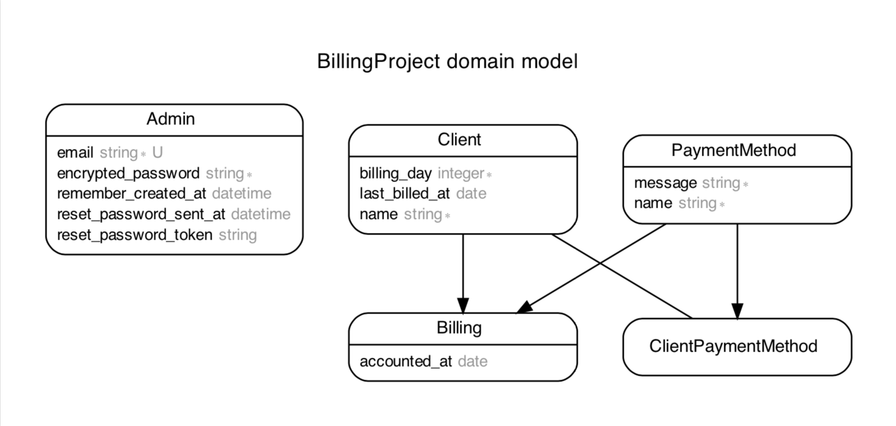

# README

Billing Project :dollar: 👨‍💻

## Versions
* **Ruby:** 2.7.1
* **Rails:** 6.1.3

## Run the project :gear:

### Setup the APP :monorail:

1. `bundle install`
2. `rake db:create db:migrate db:seed`
3. Done!

## How it works :thinking:

The project allows you to create `payment methods`, such as credit card or PIX, and charge registered `clients` in the platform.

A client can only be billed if:
- It has a payment_method defined;
- It's billing_day is equal or smaller than today;
- It have not been billed yet this month.

This is how the structure of the app looks like:

To see the rules of the test, just read the  readme in the project's root directory

## Testing :construction:

In this application we use rspec for tests. To test the application just type the following in the project's root path:

 `rspec`

## Contributing :man_technologist: :woman_technologist:

To ensure we have a high quality code all the time, you can contribute with this project by forking it into your account, make the changes you want to make and then create a PR to this repository when you're done. Remember to create a good description of what you've done, using screen shots, lists and all other resources you think will help us understanding your work :smile:

PS.: Don't forget to make tests for your changes!

That's it. Happy coding!  :computer:
